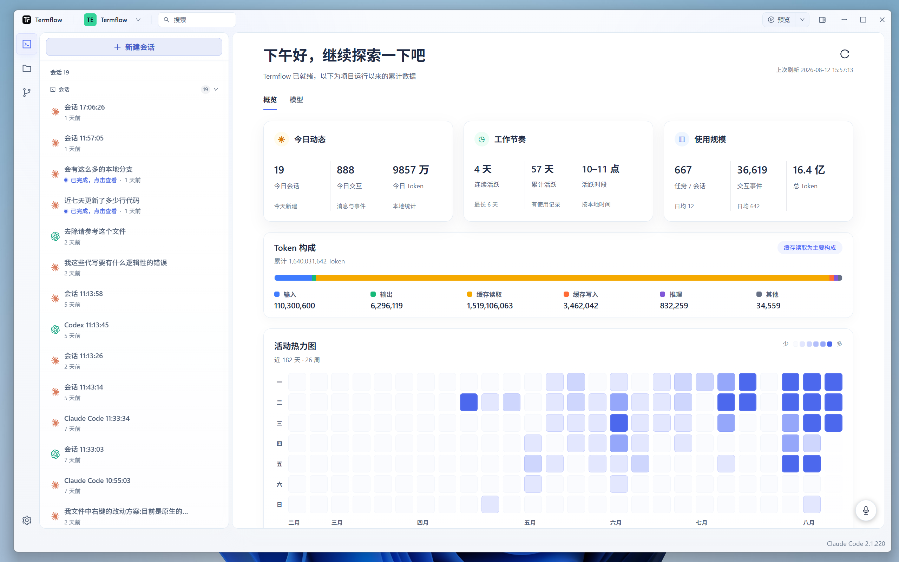
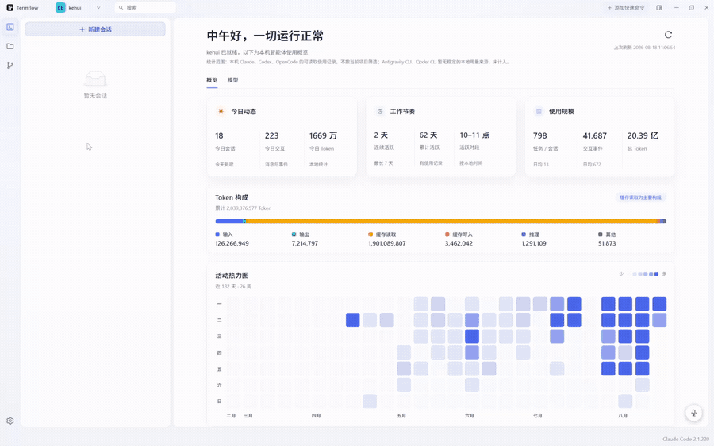
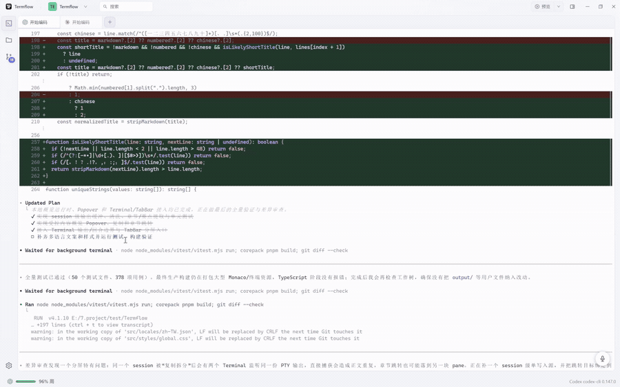
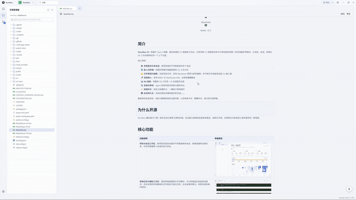
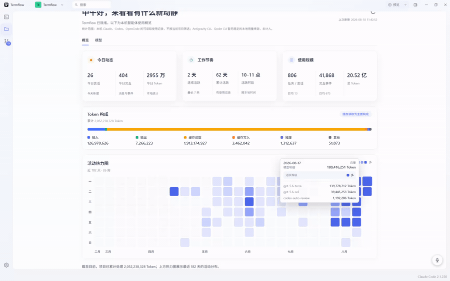

<h1 align="center">
  
  Termflow
</h1>

<p align="center">
  简体中文 | <a href="README.zh-TW.md">繁體中文</a> | <a href="README.en-US.md">English</a> | <a href="README.ja-JP.md">日本語</a>
</p>

<p align="center">
  <strong>面向终端的 CLI 智能体工作台</strong><br>
  本地优先 · 项目与会话管理 · 嵌入式终端 · Git 工作流 · 检查点审阅
</p>

<p align="center">
  
  
  
  
  
  
</p>

<p align="center">
  
</p>

## 支持的智能体

Termflow 原生支持以下 CLI 智能体：

<p align="center">
  <code> Claude Code</code>
  <code> Codex</code>
  <code> Antigravity CLI</code>
  <code> OpenCode</code>
  <code> Qoder CLI</code>
</p>

---

## 简介

**Termflow** 是一款基于 Tauri 2 构建、面向终端的 CLI 智能体工作台。它将多种 CLI 智能体的命令行体验组织到统一的本地图形界面中，让项目、会话、终端与 Git 工作流保持在同一个上下文里。

核心特性：
- 🤖 **多智能体与多会话**：按项目组织不同智能体的多个会话
- 🖥️ **嵌入式终端**：在图形界面中保留熟悉的 CLI 工作方式
- 📁 **文件管理与编辑**：浏览项目文件，支持 Markdown 预览与即时编辑，并可将文件拖放到当前 CLI 输入框
- 🎤 **语音输入**：支持 MiMo 与 DashScope ASR，全局快捷键触发
- 📊 **Git 面板**：完整的 Git 工作流 + AI 生成提交信息
- 🔍 **检查点审阅**：Agent 回合检查点审阅与差异对比
- ⚡ **快速命令**：自定义快捷命令，一键执行常用操作
- 💾 **会话持久化**：关闭应用后无缝恢复历史对话

基础体验包括深色、浅色与跟随系统的主题切换，以及简体中文、繁體中文、英文和日语界面。


## 为什么开源

Termflow 最初是为了做一款符合自己使用习惯的应用。在功能与使用体验逐渐完善后，我将它开源，也希望为大家选择工具时提供另一种选择。

## 核心功能

| 功能说明 | 界面预览 |
| :--- | :--- |
| **项目与会话工作区**：按项目目录自动组织不同智能体的会话，快速创建和切换任务，并实时掌握每个会话的运行状态。 |  |
| **旁路任务与辅助工作区**：遇到终端报错或文件问题时，可从终端选区发起侧边提问，并在右侧同时查看相关文件或运行独立任务；主会话保持原位，排查完成后随时返回。 |  |
| **文件与上下文协作**：浏览、搜索和编辑项目文件，预览 Markdown，并将文件从项目树拖放到当前 CLI 输入框，为智能体快速补充上下文。 |  |
| **Git 变更工作流**：集中完成变更查看、暂存、分支管理、提交、推送、拉取和同步，并可使用 AI 生成提交信息。 | <a href=".github/assets/demos/git-change-workflow.mp4"></a> |
| **检查点与差异审阅**：自动记录 Agent 回合检查点，集中查看文件摘要和变更差异，并可回到任意检查点。 |  |
| **快捷命令与语音输入**：通过可搜索、可参数化的快捷命令执行常用操作；支持 MiMo 与 DashScope ASR、全局快捷键和录音状态悬浮窗。 |  |
| **工作状态概览**：汇总会话活动、Token 使用和工作节奏，通过注意力中心与智能通知提示需要处理的任务。 |  |

其他基础能力包括会话持久化、自定义标题栏与无边框窗口控制、深色/浅色/跟随系统主题，以及简体中文、繁體中文、英文和日语界面。

## 技术栈

| 层级 | 技术 | 用途 |
|------|------|------|
| 框架 | Tauri 2 | 跨平台桌面应用框架 |
| 后端 | Rust + portable-pty | PTY 终端模拟、进程管理 |
| 前端 | React 19 + TypeScript 5.8 | UI 渲染 |
| 终端 | xterm.js | 浏览器端终端模拟器 |
| 状态管理 | Zustand + persist | 全局状态 + 本地持久化 |
| UI 组件 | Ant Design 5 | 按钮、弹窗、标签等 |
| 样式 | TailwindCSS 3 + CSS 变量 | 原子化样式 + 主题系统 |
| 构建 | Vite 6 | 前端构建工具 |
| 国际化 | i18next | 多语言支持（简体中文/繁體中文/英文/日语） |
| 代码编辑器 | Monaco Editor | 代码查看与编辑（Geist Mono 字体） |
| 图表渲染 | Mermaid | Git 提交历史图表 |
| 数据库 | sql.js / rusqlite | 前后端数据存储 |
| 语音识别 | MiMo + DashScope ASR | 语音输入转文字 |
| Git 操作 | libgit2 (git2-rs) | Git 仓库操作 |
| HTTP 客户端 | reqwest | 后端网络请求 |

## 快速开始

### 环境要求

- **操作系统**：Windows 10 / 11
- **Node.js**：`20.14.0`
- **pnpm**：`10.33.0`
- **Rust**：`1.95.0`
- **Rust toolchain**：`1.95.0-x86_64-pc-windows-msvc`
- **Visual Studio Build Tools 2022**：安装 `Desktop development with C++`，并勾选 Windows 10/11 SDK
- **WebView2 Runtime**：Tauri Windows 桌面应用运行所需
- **至少一个受支持的 Agent CLI**：Claude Code、Codex、Antigravity CLI、OpenCode 或 Qoder CLI；按需安装。

### 开发须知

推荐按下面顺序准备开发环境，以保持与当前仓库的工具链和依赖解析结果一致。

#### 1. 安装 Node.js 与 pnpm

本项目当前使用的 Node / pnpm 基线如下：

```bash
node -v   # v20.14.0
pnpm -v   # 10.33.0
```

安装完成 Node.js 后，使用 Corepack 固定 pnpm 版本：

```bash
corepack enable
corepack prepare pnpm@10.33.0 --activate
pnpm -v
```

> 仓库中的 `package.json` 已通过 `packageManager` 字段锁定 `pnpm@10.33.0`，配合 `pnpm-lock.yaml` 可以保证前端依赖解析结果尽量一致。

#### 2. 安装 Rust 与 MSVC 工具链

请安装 Rust，并显式使用和当前项目一致的 Windows MSVC 工具链：

```bash
rustup toolchain install 1.95.0-x86_64-pc-windows-msvc
rustup default 1.95.0-x86_64-pc-windows-msvc
rustc -V
cargo -V
```

为了让这个仓库在当前电脑上始终使用同一套 Rust 版本，建议在项目目录执行一次：

```bash
rustup override set 1.95.0-x86_64-pc-windows-msvc
rustup show active-toolchain
```

#### 3. 安装 Tauri 的 Windows 依赖

在 Windows 上开发 Tauri，除了 Rust 以外，还需要以下系统依赖：

- **Visual Studio Build Tools 2022**：至少包含 `MSVC v143` 与 Windows SDK
- **Microsoft Edge WebView2 Runtime**：用于桌面应用 WebView 容器

如果缺少这些依赖，`pnpm tauri dev` 或 `pnpm tauri build` 通常会在 Rust 编译或链接阶段失败。

#### 4. 克隆项目并安装依赖

```bash
git clone <your-repo-url>
cd Termflow
pnpm install
```

#### 5. 校验当前电脑是否与项目环境一致

建议在项目根目录执行下面的检查命令：

```bash
node -v
pnpm -v
rustc -V
cargo -V
rustup show active-toolchain
```

期望看到的关键版本：

| 工具 | 期望版本 |
|------|----------|
| Node.js | `v20.14.0` |
| pnpm | `10.33.0` |
| rustc | `1.95.0` |
| cargo | `1.95.0` |
| toolchain | `1.95.0-x86_64-pc-windows-msvc` |

### 安装依赖

```bash
pnpm install
```

### 前端开发

```bash
pnpm dev
```

默认启动前端开发服务器：`http://localhost:1420`

### 桌面应用开发

```bash
pnpm tauri dev
```

该命令会同时启动：

- Vite 前端开发服务器
- Tauri Rust 后端
- Windows 桌面应用壳

### 与当前仓库保持一致的关键点

- **前端包管理器版本**：由 `package.json` 的 `packageManager` 固定为 `pnpm@10.33.0`
- **前端依赖树**：由 `pnpm-lock.yaml` 固定
- **Rust 依赖版本**：由 `src-tauri/Cargo.toml` 固定
- **本机 Rust 工具链版本**：建议用 `rustup override set 1.95.0-x86_64-pc-windows-msvc` 在仓库级别固定
- **Tauri 开发入口**：由 `src-tauri/tauri.conf.json` 配置为 `beforeDevCommand = "pnpm dev"`

### 构建安装包

```bash
pnpm tauri build
```

构建产物位于 `src-tauri/target/release/bundle/nsis/`。

### 从资源管理器打开项目（Windows）

通过 NSIS 安装包装好后，Termflow 会为**当前 Windows 用户**注册“Open with Termflow”菜单项：

- 右键单击项目文件夹；
- 或在文件夹空白处右键单击当前目录。

它会将所选目录作为项目根目录打开；若该项目已在 Termflow 中打开，则会直接聚焦现有窗口，避免重复窗口和会话。注册仅写入当前用户的注册表，不需要管理员权限，也不会影响同一台电脑上的其他用户。卸载 Termflow 时会移除仍指向该安装位置的菜单项。

如需移除该集成，可在“设置 → 通用 → Windows 集成”中关闭“资源管理器右键菜单”；Termflow 会在之后的安装更新中保留这项偏好。

在 Windows 11 中，该首版集成会位于“显示更多选项”的传统右键菜单中。

## 配置说明

### 语音识别

Termflow 支持多种语音识别提供商：

| 提供商 | 模型 | 说明 |
|--------|------|------|
| MiMo | `mimo-v2.5-asr` | 默认提供商，使用 MiMo API 或 Token Plan |
| DashScope | `qwen3-asr-flash` | 阿里云百炼 DashScope ASR |

**配置项**：
- `asrModel`：语音识别模型（默认：`mimo-v2.5-asr`）
- 通过设置页在 MiMo 与 DashScope 提供商之间切换；切换时会更新对应模型与鉴权方式
- `voiceShortcut`：语音输入快捷键（默认：`Ctrl+Shift+V`）
- `voiceInputTarget`：语音输入目标（`system` 或 `terminal`）

### 快速命令

快速命令系统允许用户自定义常用操作：

- **命令库管理**：创建、编辑、删除自定义命令
- **分类组织**：按项目或用途分类命令
- **参数化模板**：支持变量替换的命令模板
- **一键执行**：通过快捷键或按钮快速执行

## 工作原理

以下以 Claude Code 为例说明通用 PTY 会话流程。所有 Agent 复用该流程，但由 Agent 适配层生成各自的原生启动与恢复命令。

```
用户点击"新建会话"
    ↓
选择项目目录（Tauri dialog 插件）
    ↓
前端创建会话记录（UUID + Zustand store）
    ↓
调用 spawn_pty Command（Tauri IPC）
    ↓
Rust PTY 管理器创建 ConPTY
    ↓
启动所选 Agent（例如：claude [--dangerously-skip-permissions] [--effort <level>] --session-id <uuid>）
    ↓
后台线程读取 PTY 输出 → emit("pty-output") → 前端 xterm.js 渲染
    ↓
用户输入 → invoke("pty_input") → PTY 写入
```

历史会话恢复流程（Claude Code 示例）：

```
用户点击历史会话
    ↓
检测 active === false
    ↓
cleanupSessionProcess(sessionId) — 清理当前会话的残留进程
    ↓
spawnPty(sessionId, path, resume=true)
    ↓
Agent 适配层生成恢复命令（例如：claude [--dangerously-skip-permissions] [--effort <level>] --resume <uuid>）
    ↓
所选 Agent 恢复对话上下文
```

## 致谢

Termflow 使用了以下优秀的开源项目：

- [Tauri](https://tauri.app/) - 跨平台桌面应用框架
- [React](https://react.dev/) - UI 渲染库
- [xterm.js](https://xtermjs.org/) - 浏览器端终端模拟器
- [Ant Design](https://ant.design/) - UI 组件库
- [Zustand](https://zustand-demo.pmnd.rs/) - 状态管理库
- [Vite](https://vitejs.dev/) - 前端构建工具
- [i18next](https://www.i18next.com/) - 国际化框架
- [Monaco Editor](https://microsoft.github.io/monaco-editor/) - 代码编辑器
- [Mermaid](https://mermaid-js.github.io/) - 图表渲染库
- [Geist Mono](https://vercel.com/font) - 等宽字体
- [reqwest](https://github.com/seanmonstar/reqwest) - Rust HTTP 客户端

## 许可证

本项目基于 [MIT 许可证](./LICENSE) 开源。
