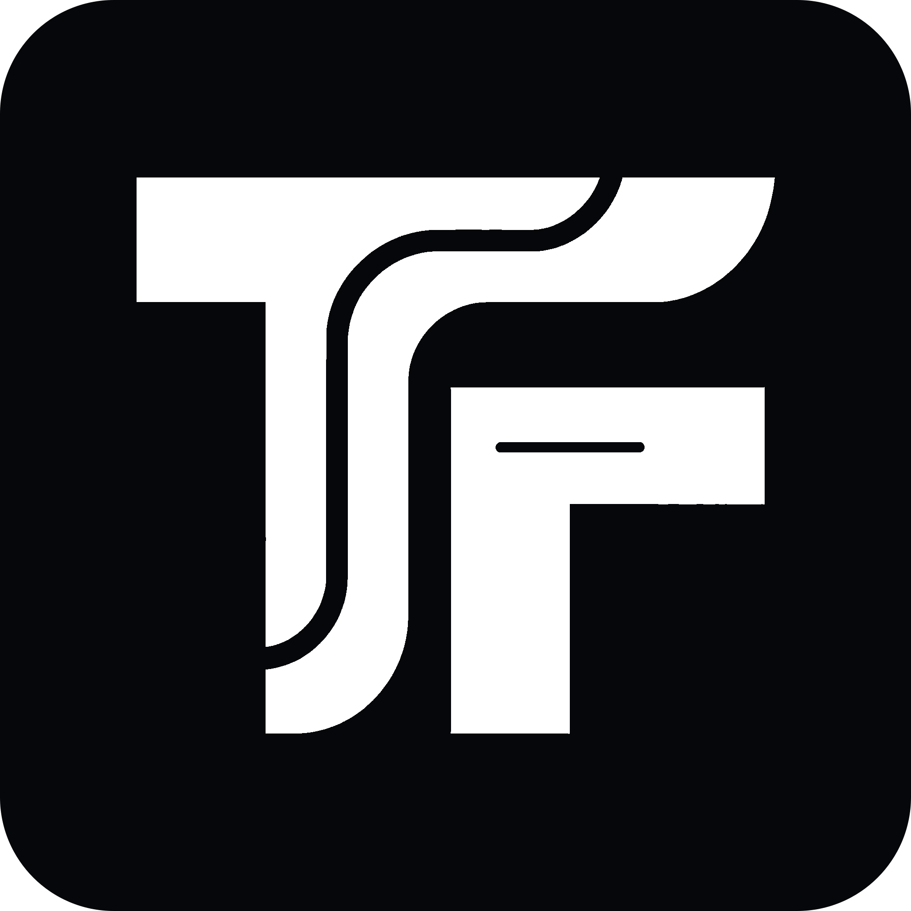
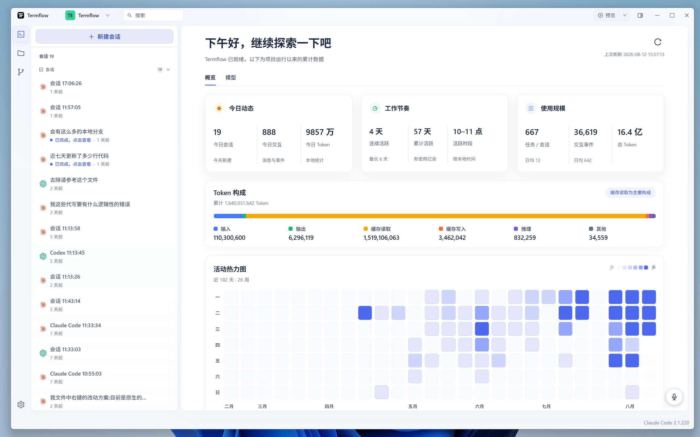
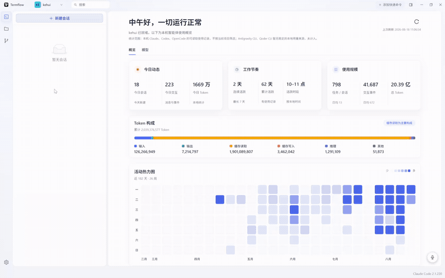
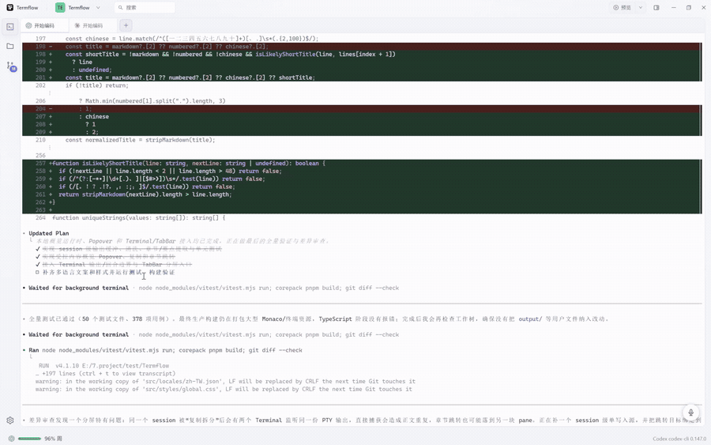
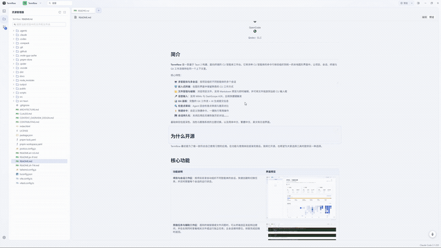
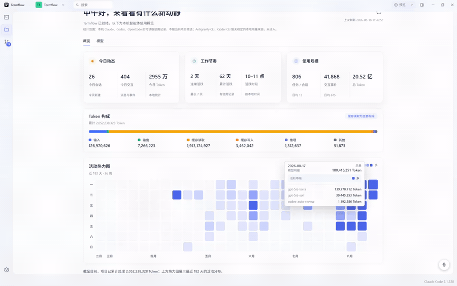

<h1 align="center">
  
  Termflow
</h1>

<p align="center">
  简体中文 | <a href="README.zh-TW.md">繁體中文</a> | <a href="README.en-US.md">English</a> | <a href="README.ja-JP.md">日本語</a>
</p>

<p align="center">
  <strong>面向终端的 CLI 智能体工作台</strong><br>
  本地优先 · 项目与会话管理 · 嵌入式终端 · Git 工作流 · 检查点审阅
</p>

<p align="center">
  
  
  
  
  
  
</p>

<p align="center">
  
</p>

## 支持的智能体

Termflow 原生支持以下 CLI 智能体：

<p align="center">
  <code> Claude Code</code>
  <code> Codex</code>
  <code> Antigravity CLI</code>
  <code> OpenCode</code>
  <code> Qoder CLI</code>
  <code> Pi</code>
</p>

---

## 简介

**Termflow** 是一款基于 Tauri 2 构建、面向终端的 CLI 智能体工作台。它将多种 CLI 智能体的命令行体验组织到统一的本地图形界面中，让项目、会话、终端与 Git 工作流保持在同一个上下文里。

核心特性：
- 🤖 **多智能体与多会话**：按项目组织不同智能体的多个会话
- 🖥️ **嵌入式终端**：在图形界面中保留熟悉的 CLI 工作方式
- 📁 **文件管理与编辑**：浏览项目文件，支持 Markdown 预览与即时编辑，并可将文件拖放到当前 CLI 输入框
- 🎤 **语音输入**：支持 MiMo 与 DashScope ASR，全局快捷键触发
- 📊 **Git 面板**：完整的 Git 工作流 + AI 生成提交信息
- 🔍 **检查点审阅**：Agent 回合检查点审阅与差异对比
- ⚡ **快速命令**：自定义快捷命令，一键执行常用操作
- 💾 **会话持久化**：关闭应用后无缝恢复历史对话

基础体验包括深色、浅色与跟随系统的主题切换，以及简体中文、繁體中文、英文和日语界面。


## 项目快捷命令

项目级快捷命令保存在项目根目录的 `.termflow/quick-commands.json`，终端命令和智能体提示都使用这个文件。首次打开项目时，已有的本机项目命令会自动迁移；全局命令仍保存在本机。

将该文件随项目一起复制到其他电脑，或提交到 Git，即可恢复项目快捷命令，无需保持相同的项目路径。终端命令以当前项目目录为工作目录，建议使用相对路径。打开项目或重新聚焦窗口时会读取配置；编辑、删除命令也会更新文件。

## 项目启动组合

标题栏的“项目启动组合”支持编辑、保存和运行 `.termflow/launchers.json`，一次打开多个普通终端。先选择组合查看目录与命令，再点击运行；打开项目或保存配置不会执行命令。终端使用本机默认 Shell，配置里的命令需与该 Shell 兼容。

```json
{
  "version": 1,
  "launchers": [
    {
      "id": "dev",
      "name": "开发环境",
      "terminals": [
        { "title": "前端", "directory": ".", "command": "pnpm dev" },
        { "title": "Rust 检查", "directory": "src-tauri", "command": "cargo check" }
      ]
    }
  ]
}
```

`directory` 必须是项目内已存在的相对目录，根目录用 `.`；`command` 留空则只打开终端。配置版本为 1，最多 40 个组合，每组 1–12 个终端，组合 ID 必须唯一。运行前会检查整组目录；启动失败时会关闭本次创建的终端，已执行命令的外部效果无法回滚。

`.termflow/quick-commands.json` 与 `.termflow/launchers.json` 可以提交 Git；个人本机文件约定放在 `.termflow/local/` 并加入各项目的 `.gitignore`（本仓库已配置）。标签页与分屏状态继续保存在本机，不提供 `workspaces.json`，也不在这里配置项目默认智能体或智能体启动参数。`AGENTS.md`、`CLAUDE.md` 保留原位置。

## 为什么开源

Termflow 最初是为了做一款符合自己使用习惯的应用。在功能与使用体验逐渐完善后，我将它开源，也希望为大家选择工具时提供另一种选择。

## 核心功能

| 功能说明 | 界面预览 |
| :--- | :--- |
| **项目与会话工作区**：按项目目录自动组织不同智能体的会话，快速创建和切换任务，并实时掌握每个会话的运行状态。 |  |
| **旁路任务与辅助工作区**：遇到终端报错或文件问题时，可从终端选区发起侧边提问，并在右侧同时查看相关文件或运行独立任务；主会话保持原位，排查完成后随时返回。 |  |
| **文件与上下文协作**：浏览、搜索和编辑项目文件，预览 Markdown，并将文件从项目树拖放到当前 CLI 输入框，为智能体快速补充上下文。 |  |
| **Git 变更工作流**：集中完成变更查看、暂存、分支管理、提交、推送、拉取和同步，并可使用 AI 生成提交信息。 | <a href=".github/assets/demos/git-change-workflow.mp4"></a> |
| **检查点与差异审阅**：自动记录 Agent 回合检查点，集中查看文件摘要和变更差异，并可回到任意检查点。 |  |
| **快捷命令与语音输入**：通过可搜索、可参数化的快捷命令执行常用操作；支持 MiMo 与 DashScope ASR、全局快捷键和录音状态悬浮窗。 |  |
| **工作状态概览**：汇总会话活动、Token 使用和工作节奏，通过注意力中心与智能通知提示需要处理的任务。 |  |

其他基础能力包括会话持久化、自定义标题栏与无边框窗口控制、深色/浅色/跟随系统主题，以及简体中文、繁體中文、英文和日语界面。

## 技术栈

| 层级 | 技术 | 用途 |
|------|------|------|
| 框架 | Tauri 2 | 跨平台桌面应用框架 |
| 后端 | Rust + portable-pty | PTY 终端模拟、进程管理 |
| 前端 | React 19 + TypeScript 5.8 | UI 渲染 |
| 终端 | xterm.js | 浏览器端终端模拟器 |
| 状态管理 | Zustand + persist | 全局状态 + 本地持久化 |
| UI 组件 | Ant Design 5 | 按钮、弹窗、标签等 |
| 样式 | TailwindCSS 3 + CSS 变量 | 原子化样式 + 主题系统 |
| 构建 | Vite 6 | 前端构建工具 |
| 国际化 | i18next | 多语言支持（简体中文/繁體中文/英文/日语） |
| 代码编辑器 | Monaco Editor | 代码查看与编辑（Geist Mono 字体） |
| 图表渲染 | Mermaid | Git 提交历史图表 |
| 数据库 | sql.js / rusqlite | 前后端数据存储 |
| 语音识别 | MiMo + DashScope ASR | 语音输入转文字 |
| Git 操作 | libgit2 (git2-rs) | Git 仓库操作 |
| HTTP 客户端 | reqwest | 后端网络请求 |

## 致谢

Termflow 使用了以下优秀的开源项目：

- [Tauri](https://tauri.app/) - 跨平台桌面应用框架
- [React](https://react.dev/) - UI 渲染库
- [xterm.js](https://xtermjs.org/) - 浏览器端终端模拟器
- [Ant Design](https://ant.design/) - UI 组件库
- [Zustand](https://zustand-demo.pmnd.rs/) - 状态管理库
- [Vite](https://vitejs.dev/) - 前端构建工具
- [i18next](https://www.i18next.com/) - 国际化框架
- [Monaco Editor](https://microsoft.github.io/monaco-editor/) - 代码编辑器
- [Mermaid](https://mermaid-js.github.io/) - 图表渲染库
- [Geist Mono](https://vercel.com/font) - 等宽字体
- [reqwest](https://github.com/seanmonstar/reqwest) - Rust HTTP 客户端

## 许可证

本项目基于 [MIT 许可证](./LICENSE) 开源。
